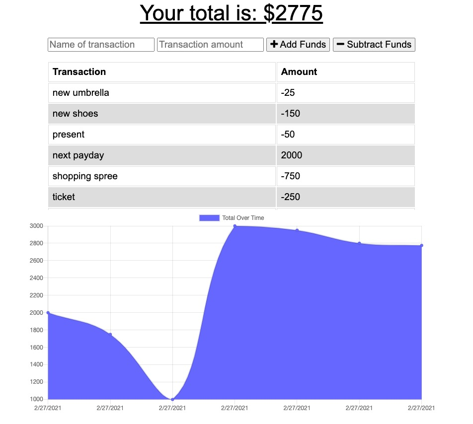
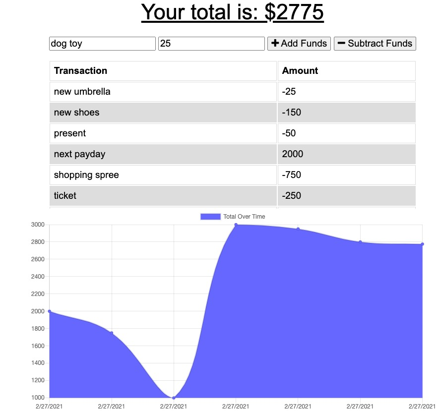
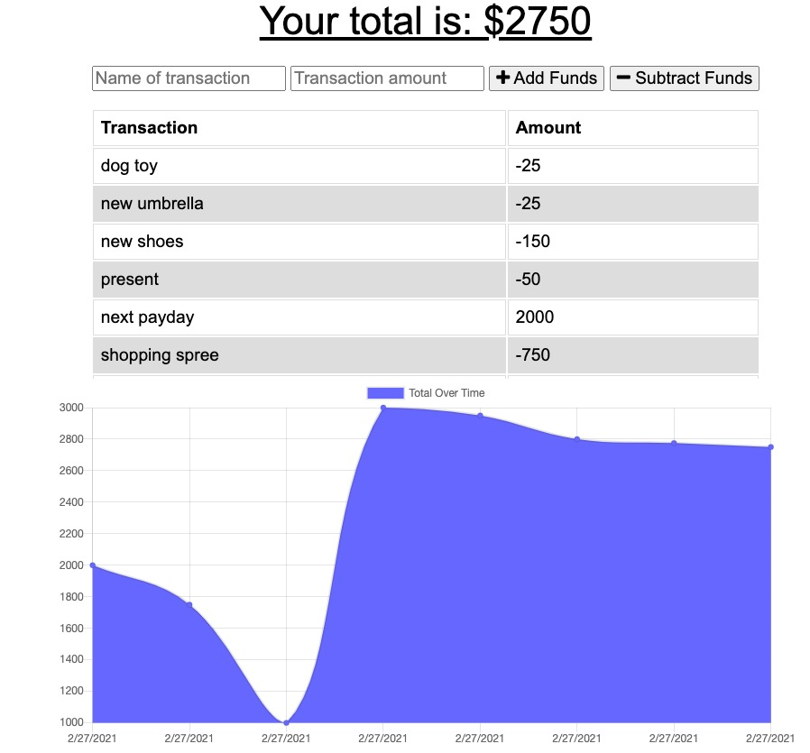
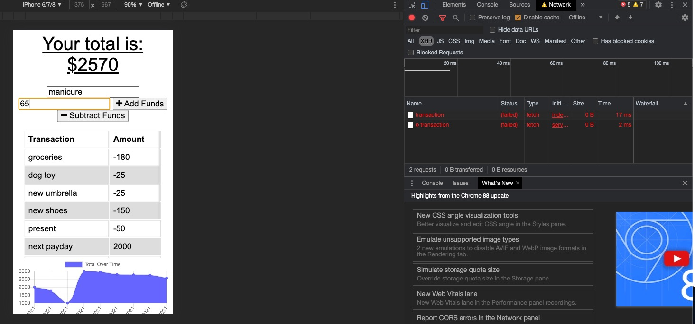
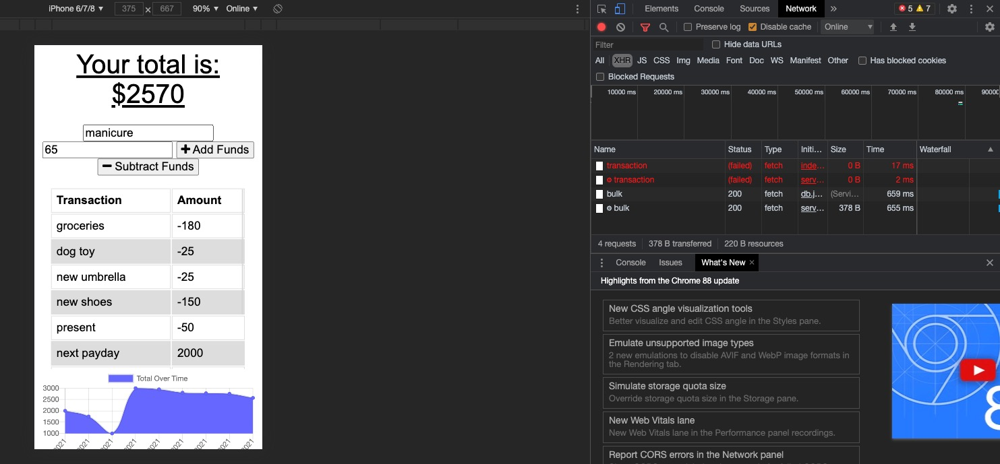
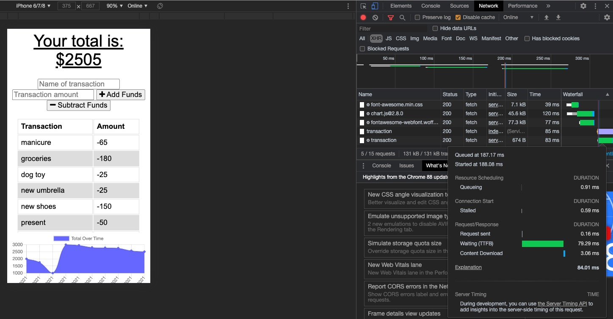

# FitTrackApp

### Description

The application is a progressive web application, meaning that it has a manifest and serviceworker and also functions while in offline status. Most importantly, once the application is back online, any budget additions or subtractions are still present in the tracker.

### Installation

The following technologies will need to be downloaded prior to use: express, morgan, compression, and mongoose. 

## Technology

In addition to express and mongoose, this application uses mongodb to track amounts while online. While offline, indexDB is used to track any offline changes.  

### Demonstration

### Demonstration

### Demonstration

### Demonstration

### Demonstration

### Demonstration

### Repository
[Repository](https://github.com/stacyo23/BudgetAnywhere)

### Heroku
[Heroku](https://rocky-ridge-69487.herokuapp.com/)

## Contact
Please feel free to contact me at stacyo23@yahoo.com for questions or feedback. To see other projects, please visit https://github.com/stacyo23/.
